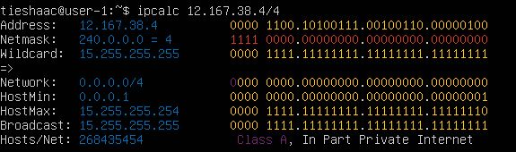
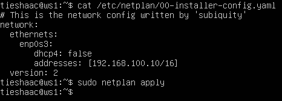
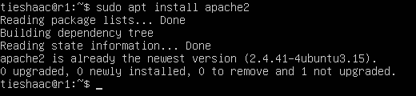
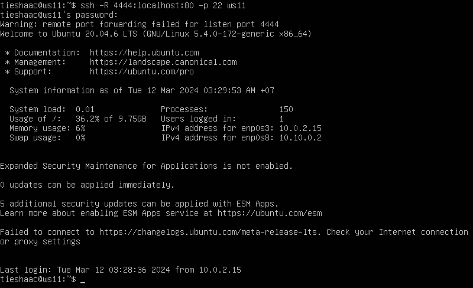

# Linux Network

## Part 1. Инструмент **ipcalc**

### 1.1. Сети и маски 

##### Определить и записать в отчёт:
1) **Адрес сети 192.167.38.54/13** \
 \
**- адрес сети:** *192.160.0.0/13*

2) **Перевод масок**
- 255.255.255.0 в префиксную и двоичную: \
 \
**- префиксная**: /24 \
**- двоичная**: 11111111.11111111.11111111.00000000

- /15 в обычную и двоичную: \
 \
**- обычная**: *255.254.0.0* \
**- двоичная**: *11111111.11111110.00000000.00000000*

- 11111111.11111111.11111111.11110000 в обычную и префиксную \
Так как ipcalc не работает с двоичными числами переведем вручную и проверим полученные значения через ipcalc. \
 \
**- обычная**: *255.255.255.240* \
**- префиксная**: */28*

3) **Минимальный и максимальный хост в сети 12.167.38.4**:
- при маске /8: \
 \
**- HostMin**: *12.0.0.1* \
**- HostMax**: *12.255.255.254*

- при маске 11111111.11111111.00000000.00000000: \
 \
**- HostMin**: *12.167.0.1* \
**- HostMax**: *12.167.255.254*

- при маске 255.255.254.0: \
 \
**- HostMin**: *12.167.38.1* \
**- HostMax**: *12.167.39.254*

- при маске /4: \
 \
**- HostMin**: *0.0.0.1* \
**- HostMax**: *15.255.255.254*

### 1.2. localhost

##### Определи и запиши в отчёт, можно ли обратиться к приложению, работающему на localhost, со следующими IP: 194.34.23.100, 127.0.0.2, 127.1.0.1, 128.0.0.1
- Вызов команды ipcalc 127.0.0.0: \
 \
Адреса на localhost должны находиться в диапазоне *127.0.0.1 - 127.255.255.254*, поэтому: \
**- можно**: *127.0.0.2, 127.1.0.1* \
**- нельзя**: *194.34.23.100, 128.0.0.1*

### 1.3. Диапазоны и сегменты сетей

##### Определить и записвть в отчёт:

1) **Какие из перечисленных IP можно использовать в качестве публичного, а какие только в качестве частных**: *10.0.0.45, 134.43.0.2, 192.168.4.2, 172.20.250.4, 172.0.2.1, 192.172.0.1, 172.68.0.2, 172.16.255.255, 10.10.10.10, 192.169.168.1* <br><br>
Согласно классификации IP-адресов следующие диапазоны адресов зарезервированы для частных (локальных) сетей \
**- только частные**: *10.0.0.45, 192.168.4.2, 172.20.250.4, 172.16.255.255, 10.10.10.10;* \
**- публичные**: *134.43.0.2, 172.0.2.1, 192.172.0.1, 172.68.0.2, 192.169.168.1.* \

Проверим адреса с помощью ipcalc для подтверждения.
- 10.0.0.45 \


- 192.168.4.2 \


- 172.20.250.4 \


- 172.16.255.255 \


- 10.10.10.10 \


- 134.43.0.2 \


- 172.0.2.1 \


- 192.172.0.1 \


- 172.68.0.2 \


- 192.169.168.1 \


2) Какие из перечисленных IP адресов шлюза возможны у сети 10.10.0.0/18: 10.0.0.1, 10.10.0.2, 10.10.10.10, 10.10.100.1, 10.10.1.255 \
 \
Сеть 10.10.0.0/18 включает в себя диапазон IP-адресов от 10.10.0.0 до 10.10.63.255. Следовательно, шлюз должен находиться в этом диапазоне. \
**- возможны**: *10.10.0.1, 10.10.0.2, 10.10.1.255* \
**- невозможны**: *10.10.10.10, 10.10.100.1*

## Part 2. Статическая маршрутизация между двумя машинами

##### Чтобы поднять две виртуальные машины (далее -- ws1 и ws2) склонируем в VirtualBox первую машину ws1 и установим имя хоста ws2 и перезагрузим для применения изменений

- ws1 и ws2: \
<br>

- В настройках сети укажем у обоих машин "Сетевой мост" \
<br>

##### С помощью команды ip a посмотреть существующие сетевые интерфейсы. В отчёт поместим скрин с вызовом и выводом использованной команды.

- ws1: \
<br>

- ws2: \
<br>

##### Описать сетевой интерфейс, соответствующий внутренней сети, на обеих машинах

- ws1: netstat -nr: \
<br>

- ws2: netstat -nr: \
<br>

##### Зададим следующие адреса и маски: ws1 - 192.168.100.10, маска /16, ws2 - 172.24.116.8, маска /12 и применим с помошью команды netplan apply:

- ws1: \
<br>

- ws2: \
<br>

### 2.1. Добавление статического маршрута вручную

##### Добавим статический маршрут от одной машины до другой и обратно при помощи команды вида "ip r add" и пропингуем соединение между машинами`

- ws1: \
<br>

- ws2: \
<br>

### 2.2. Добавь статический маршрут с сохранением

##### Добавим статический маршрут от одной машины до другой с помощью прописания прямого маршрута в файле etc/netplan/00-installer-config.yaml:

- ws1: \
<br>

- ws2: \
<br>

##### Пропингуем соединение между машинами:

- ws1: \
<br>

- ws2: \
<br>

## Part 3. Утилита **iperf3**

В данной части необходима будет не только связь машин между собой, но и сеть интернет для установки утилиты iperf3. Поэтому выставим несколько адаптеров в настройках сети виртуальных машин в VirtualBox. Тип подключения для адаптера 1: NAT и для второго адаптера: внутренняя сеть.

- Настройки сети для ws1 в VirtualBox: \


Для ws2 настройки сети в VirtualBox аналогичные.

Также изменим настройки сети в файле yaml и применим изменения командой `sudo netplan apply`.
- ws1: \


- ws2: \
<br>

### 3.1. Скорость соединения

##### Перевести и записать в отчёт: 8 Mbps в MB/s, 100 MB/s в Kbps, 1 Gbps в Mbps.
- 8 Mbps: 1 MB/s
- 100 MB/s = 819200 Kbps
- 1 Gbps = 1024 Mbps

### 3.2. Утилита **iperf3**

##### Измерь скорость соединения между ws1 и ws2.

Для этого установим утилиту iperf3 с помощью команды: `sudo apt install iperf3`. После чего запустим команду `iperf3 -s` на ws1 и параллельно запустим команду `iperf3 -c 192.168.100.10` на ws2.

- Вывод команды iperf3 на ws1: \
<br>

- Вывод команды iperf3 на ws2: \
<br>

##### Таким образом скорость соединения между ws1 и ws2: `4.34 Gbits/sec`.

## Part 4. Сетевой экран

### 4.1. Утилита **iptables**

##### Создадим файл /etc/firewall.sh, имитирующий фаерволл, на ws1 и ws2 и применим следующий перечень правил:

1) На ws1 примени стратегию, когда в начале пишется запрещающее правило, а в конце пишется разрешающее правило (это касается пунктов 4 и 5)
2) На ws2 примени стратегию, когда в начале пишется разрешающее правило, а в конце пишется запрещающее правило (это касается пунктов 4 и 5)
3) Открой на машинах доступ для порта 22 (ssh) и порта 80 (http)
4) Запрети echo reply (машина не должна «пинговаться», т.е. должна быть блокировка на OUTPUT)
5) Разреши echo reply (машина должна «пинговаться»)

В отчёт поместим скрины с содержанием файла /etc/firewall для каждой машины.

- Содержание файла /etc/firewall.sh для ws1: \
<br>

- Содержание файла /etc/firewall.sh для ws2: \
<br>

##### Выдадим права на исполнение на обеих машинах командой `chmod +x /etc/firewall.sh` и запустим их с повышенными правами.

- Запустим файл firewall.sh на ws1: \
<br>

- Запустим файл firewall.sh на ws2: \
<br>

##### Правила выполняются сверху-вниз, т.е. если правило запрета находится выше, то оно - срабатывает, а если правило разрешения находится ниже - нет. И всё зависит от метода reply или request, в данном случае используется reply, поэтому ws1 пингуется, а ws2 нет.

### 4.2. Утилита **nmap**


Установим утилиту nmap командой `sudo apt install nmap`.<br>

- Проверим ping на ws1 с запущенным фаерволлом: \
<br>

##### Теперь воспользовуемся утилитой nmap, в выводе команды должно быть сказано: *Host is up*.<br>

- Запустим утилиту nmap на ws1: \
<br>

- Проверяем ping на ws2 с запущенным фаерволлом: \
<br>

- Запустим утилиту nmap на ws2: \
<br>

##### Таким образом, ws2 хоть и не пингуется из-за запущенного файервола, но хост машины запущен и работает.

##### Сохраним дампы образов виртуальных машин (конечно же не в git)

## Part 5. Статическая маршрутизация сети

Поднимим пять виртуальных машин (3 рабочие станции (ws11, ws21, ws22) и 2 роутера (r1, r2)).

- Сеть: \


Настроим адаптеры сети каждой машины в VirtualBox в соответствии с рисунком карты сети выше, запустим и зададим машинам соответствующие имена хостов при помощи команды `sudo hostnamectl set-hostname <hostnamename>` с последующей перезагрузкой.

- r1 \

- r2 \

- ws11 \

- ws21 \

- ws22 \


### 5.1. Настройка адресов машин

##### Настроим конфигурации машин в файле etc/netplan/00-installer-config.yaml согласно сети на рисунке и поместим в отчёт скрины с содержанием этого файла для каждой машины.

- r1 \

- r2 \

- ws11 \

- ws21 \

- ws22 \


##### Применим изменения конфигурации сетей командой `sudo netplan apply`. Ошибок нет, поэтому командой `ip -4 a` проверим, что адрес машины задан верно.
- r1 \

- r2 \

- ws11 \

- ws21 \

- ws22 \


##### Теперь пропингуем наши машины в соответствии с заданием.

- Пропингуеи ws22 с ws21: \


- Аналогично пропингуем r1 с ws11: \


### 5.2. Включение переадресации IP-адресов.

##### Для включения переадресации IP, выполним команду на роутерах:

`sysctl -w net.ipv4.ip_forward=1`

При таком подходе переадресация не будет работать после перезагрузки системы.

- Вызов команды на r1: \


- Вызов команды на r2: \


##### Чтобы IP-переадресация была включена на постоянной основе, откроем файл /etc/sysctl.conf и раскомментируем следующую строку `net.ipv4.ip_forward = 1`:

- Содержание изменённого файла /etc/sysctl.conf на r1: \


- Содержание изменённого файла /etc/sysctl.conf на r2: \


### 5.3. Установка маршрута по-умолчанию

##### Настроим маршрут по-умолчанию (шлюз) для рабочих станций. Для этого добавим `default` перед IP роутера в файле конфигураций *etc/netplan/00-installer-config.yaml*.

- Изменяем файл конфигураций на ws11: \


- Изменяем файл конфигураций на ws21: \


- Изменяем файл конфигураций на ws22: \


##### Вызовим `ip r` и покажем, что добавился маршрут в таблицу маршрутизации

- Вызов команды `ip r` на ws11: \


- Вызов команды `ip r` на ws21: \


- Вызов команды `ip r` на ws22: \


##### Пропингуем с ws11 роутер r2:

- Вызов команды на ws11: \


##### Покажем на r2, что пинг доходит.

- Для этого используем команду: `tcpdump -tn -i eth0` \


### 5.4. Добавление статических маршрутов

##### Добавим по примеру в роутеры r1 и r2 статические маршруты в файле конфигураций. 

- Содержание изменённого файла конфигурации на r1: \


- Содержание изменённого файла конфигурации на r2: \


##### Вызовим `ip r` и покажи таблицы с маршрутами на обоих роутерах.

- Вызов команды `ip r` на r1: \


- Вызов команды `ip r` на r2: \


##### Запустим команды `ip r list 10.10.0.0/[маска сети]` и `ip r list 0.0.0.0/0` на ws11:

- Вызов команд `ip r list` на ws11: \


- В отчёте объясни, почему для адреса 10.10.0.0/\[маска сети\] был выбран маршрут, отличный от 0.0.0.0/0, хотя он попадает под маршрут по-умолчанию.

##### Для адреса 10.10.0.0/18 был выбран маршрут, отличный от 0.0.0.0/0, поскольку этот адрес уже есть в сети устройства и для дальнейшей передачи пакета обращаться к маршрутизатору не обязательно. 

### 5.5. Построение списка маршрутизаторов

Пример вывода утилиты **traceroute** после добавления шлюза:
```
1 10.10.0.1 0 ms 1 ms 0 ms
2 10.100.0.12 1 ms 0 ms 1 ms
3 10.20.0.10 12 ms 1 ms 3 ms
```
##### Запустим на r1 команду дампа.

- Вызов команды `sudo tcpdump -tnv -i eth0` на r1: \


##### При помощи утилиты **traceroute** построем список маршрутизаторов на пути от ws11 до ws21.

- Вызов команды `traceroute` на ws11 до ws21: \


##### Принцип работы построения пути при помощи **traceroute**:
- Traceroute использует серию ICMP-пакетов, увеличивая значение поля TTL с каждым шагом, чтобы определить промежуточные маршрутизаторы. Первая серия пакетов отправляется с TTL=1, что заставляет первый маршрутизатор вернуть сообщение "time exceeded in transit". Затем процесс повторяется с увеличением TTL, пока пакет не достигнет целевого узла. Каждый маршрутизатор фиксируется, и время между отправкой пакета и получением ответа выводится на монитор.

### 5.6. Использование протокола **ICMP** при маршрутизации

##### Запустим на r1 перехват сетевого трафика, проходящего через eth0:

- Вызов команды `tcpdump -n -i eth0 icmp` на r1: \


##### Пропингуем с ws11 несуществующий IP (например, *10.30.0.111*):

- Вызов команды `ping -c 1 10.30.0.111` на ws11: \


##### Сохраним дампы образов виртуальных машин (конечно же не в git)

## Part 6. Динамическая настройка IP с помощью **DHCP**

Для начала установим isc-dhcp-server на машинах r1 и r2 командой `sudo apt install isc-dhcp-server`.

##### 1) Укажи адрес маршрутизатора по-умолчанию, DNS-сервер и адрес внутренней сети. Пример файла для r2:

- Для r2 настроим конфигурацию службы **DHCP** в файле */etc/dhcp/dhcpd.conf*: \


##### 2) В файле *resolv.conf* пропиши `nameserver 8.8.8.8`.
- откроем файл */etc/resolv.conf* через редактор с повышенными правами и пропишем `nameserver 8.8.8.8`, после чего выведем содержание измененного файла через команду `cat`: \


- перезагрузим службу **DHCP** на r2 командой `systemctl restart isc-dhcp-server`:


- Машину ws21 перезагрузи при помощи `reboot` и через `ip a` покажи, что она получила адрес. Также пропингуй ws22 с ws21: \


- укажем MAC адрес у ws11, для этого в *etc/netplan/00-installer-config.yaml* добавим строки: `macaddress: 10:10:10:10:10:BA`, `dhcp4: true`\


##### Для r1 настрой аналогично r2, но сделай выдачу адресов с жесткой привязкой к MAC-адресу (ws11). Проведи аналогичные тесты
- Для r1 также настроим конфигурацию службы DHCP в файле /etc/dhcp/dhcpd.conf: \


- откроем файл */etc/resolv.conf* через редактор с повышенными правами и пропишем `nameserver 8.8.8.8`, после чего выведем содержание измененного файла через команду `cat`: \


- перезагрузим службу **DHCP** на r1 командой `systemctl restart isc-dhcp-server`:


- чтобы отобразить IP на ws21 до обновления, очистим старый адрес с помощью команды `sudo dhclient -r enp0s8`:


- запрсим новый IP командой`sudo dhclient enp0s8ws21` и смотрим результат после обновления:


##### Команда dhclient -r enp0s8 очищает текущий динамический IP для интерфейса enp0s8. Команда dhclient enp0s8 задает новый динамический IP для интерфейса enp0s8.

##### Сохраним дампы образов виртуальных машин (конечно же не в git)

## Part 7. **NAT**

##### В файле */etc/apache2/ports.conf* на ws22 и r1 измени строку `Listen 80` на `Listen 0.0.0.0:80`, то есть сделай сервер Apache2 общедоступным

- установим для начала Apache2 на r1: \


- теперь в файле /etc/apache2/ports.conf r1 изменим строку Listen 80 на Listen 0.0.0.0:80: \


- установим для начала Apache2 на ws22: \


- теперь в файле /etc/apache2/ports.conf ws22 изменим строку Listen 80 на Listen 0.0.0.0:80: \


##### Запусти веб-сервер Apache командой service apache2 start на ws22 и r1

- запустим сервер Apache2 на r1: \


- запустим сервер Apache2 на ws22: \


##### Добавь в фаервол, созданный по аналогии с фаерволом из Части 4, на r2 следующие правила:
1) Удаление правил в таблице filter - iptables -F
2) Удаление правил в таблице "NAT" - iptables -F -t nat
3) Отбрасывать все маршрутизируемые пакеты - iptables --policy FORWARD DROP

- добавим эти три строки в /etc/firewall.sh на r2: \

 
- при запуске файла `/etc/firewall.sh`  с этими правилами, ws22 не должна «пинговаться» с r1:

- запустим файл `/etc/firewall.sh` также, как в Части 4, т.е. дадим права на выполнение `sudo chmod +x /etc/firewall.sh` и запустим командой `sudo sh /etc/firewall.sh`.

- проверим соединение между ws22 и r1 командой `ping` и убедимся, что ws22 не «пингуется» с r1: \


##### Добавь в файл ещё одно правило:

4) Разрешить маршрутизацию всех пакетов протокола **ICMP**

- добавляем правило для разрешения маршрутизацию всех пакетов протокола **ICMP**: \


- проверим соединение между ws22 и r1 командой `ping` и убедимся, что теперь ws22 «пингуется» с r1, после разрешения маршрутизацию всех пакетов протокола **ICMP**: \


##### Добавь в файл ещё два правила:

5) Включить **SNAT**, а именно маскирование всех локальных ip из локальной сети, находящейся за r2 (по обозначениям из Части 5 - сеть 10.20.0.0) \
*Совет: стоит подумать о маршрутизации внутренних пакетов, а также внешних пакетов с установленным соединением*

6) Включить **DNAT** на 8080 порт машины r2 и добавить к веб-серверу Apache, запущенному на ws22, доступ извне сети \
*Совет: стоит учесть, что при попытке подключения возникнет новое tcp-соединение, предназначенное ws22 и 80 порту*

- добавляем правила для **SNAT** и для **DNAT** на r2: \


- запустим файл `/etc/firewall.sh` также, как в Части 4, т.е. дадим права на выполнение `sudo chmod +x /etc/firewall.sh` и запустим командой `sudo sh /etc/firewall.sh`.

*Перед тестированием рекомендуется отключить сетевой интерфейс **NAT** (его наличие можно проверить командой `ip a`) в VirtualBox, если он включен*

- выполним данную рекомендацию, отключим в VirtualBox сетевой интерфейс **NAT** на всех машинах.

##### Проверь соединение по TCP для **SNAT**: для этого с ws22 подключиться к серверу Apache на r1 командой: `telnet [адрес] [порт]`

- попробуем с ws22 подключиться к серверу Apache на r1: \


##### Проверь соединение по TCP для **DNAT**: для этого с r1 подключиться к серверу Apache на ws22 командой `telnet` (обращаться по адресу r2 и порту 8080)

- попробуем с r1 подключиться к серверу Apache на ws22: \


##### Сохраним дампы образов виртуальных машин (конечно же не в git)

## Part 8. Дополнительно. Знакомство с **SSH Tunnels**

##### Запусти на r2 фаервол с правилами из Части 7

- выводим правила фаервола на r2 из Части 7: \


- запустим файл `/etc/firewall.sh` также, как в Части 4, т.е. дадим права на выполнение `sudo chmod +x /etc/firewall.sh` и запустим командой `sudo sh /etc/firewall.sh`.

##### Запусти веб-сервер **Apache** на ws22 только на localhost (то есть в файле */etc/apache2/ports.conf* измени строку `Listen 80` на `Listen localhost:80`)

- изменим Listen 0.0.0.0:80 на Listen localhost:80 и перезапустим сервер Apache2 \


##### Воспользуйся *Local TCP forwarding* с ws21 до ws22, чтобы получить доступ к веб-серверу на ws22 с ws21

- воспользуемся *Local TCP forwarding* с ws21 до ws22, чтобы получить доступ к веб-серверу на ws22 с ws21: \


##### Воспользуйся *Remote TCP forwarding* c ws11 до ws22, чтобы получить доступ к веб-серверу на ws22 с ws11

- воспользуемся *Remote TCP forwarding* c ws11 до ws22, чтобы получить доступ к веб-серверу на ws22 с ws11: \


##### Для проверки, сработало ли подключение в обоих предыдущих пунктах, перейди во второй терминал (например, клавишами Alt + F2) и выполни команду:
`telnet 127.0.0.1 [локальный порт]`
- В отчёте опиши команды, необходимые для выполнения этих четырёх пунктов, а также приложи скриншоты с их вызовом и выводом.

- выполним проверку: \


- выполним проверку: \


##### Сохраним дампы образов виртуальных машин (конечно же не в git)

